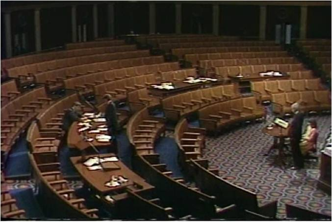
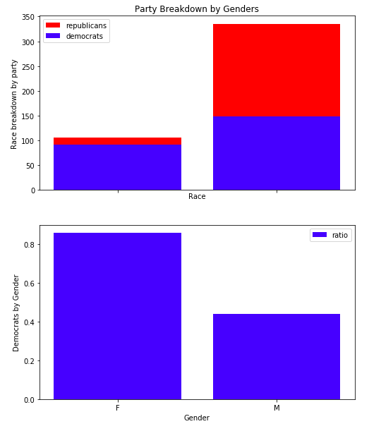
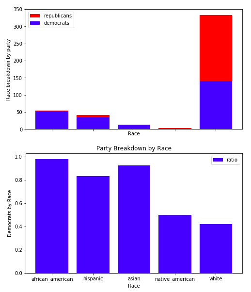

# Exploring Congressional Data

### Making congress more accountable with data.

There is a wealth of data out there that congressmen will put out to the public, from tv interviews, twitter retweets, books and campaign speeches. We don’t care about that. Well we do, but there is so much more data out there that is just under the surface.

Why are we doing this? There is a story about Newt Gingrich when he was first elected in the 90’s.Twenty-four hour news channels were in their infancy. Radio shock jocks were getting established. And most importantly for this story C-Span was just being born. This is when Newt had a brilliant idea. He would, after session was over, present in front of the always on cameras. He would lecture in front of an empty chamber, uninterrupted, and to a live television audience about morals, and tradition, taxes, marriage, crime anything whether it had anything to do with the business of congress or not. But he would always point the finger at the chamber itself. “Congress was broken. Your political system is broken.”

Newt is largely attributed for creating the partisan polarized envirnoment that persists until now.

Newt was exceptionally media savvy for his era. Now we have more than C-Span. We have a news network for every kind of viewer, twitter, and facebook.
And while theoretically all congressional action is freely available and part of the record, the truth is that there is a public facing congress and the real congress. Is congress working for you? Is what they say to the public the same as what they’re doing in their chambers?

### Tools for staying on top of Congress

#### Scrapy is used in extracting the data from websites.
- Government Datasets
-- http://catalog.data.gov/
- Scrapy handles both navigation and extraction, complete solution
- BeautifulSoup only handles scraping
- Selenium is sometimes slower and more memory-intensive

#### APACHE Tika detects and extracts text and metatext from files
- Text extraction
- PDF -> txt

#### Congressional API
- Propublica: Congressional Roll Calls, Member data   
  https://www.propublica.org/datastore/apis
- NYTimes: National News  
https://developer.nytimes.com/
- GovTrack.us: Upcoming bills  
https://www.govtrack.us/about-our-data
- OpenSecrets.org: Lobbying, PAC's and donations  
https://www.opensecrets.org/open-data/api
- Sunlight Foundation
https://sunlightfoundation.com/api/

#### Demographics
Using API’s we can visualize the Demographics of Congress
- 116th Congress by Gender

- 116th Congress by Race

#### Future Analysis
- What bills will pass?
- Topic frequency, bill names, trends in policy
- How do sentiments change over the course of a career?
- Are there differences by gender? By race?
- Does sentiment on Twitter differ from sentiment on the floor?
- How does VADER compare with IFILL, SpaCy, etc.?
